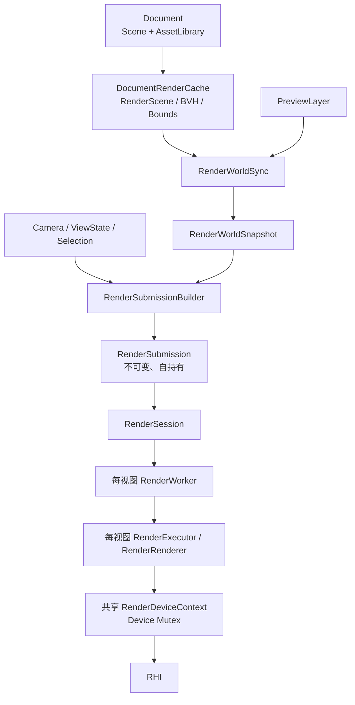
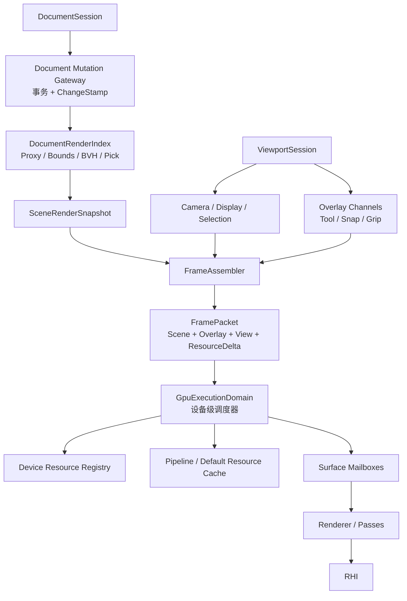

# RHI 上层架构工业化分析与演进方案

> 分析日期：2026-07-15  
> 分析范围：仅基于当前真实代码，覆盖 Document、Scene、Asset、Editor、View、Render Frontend、Render Runtime、Render Backend 到 RHI 的完整上层调用链。  
> 本文定位：架构分析与分阶段演进方案，不代表要求一次性重构，也不包含功能扩张。

## 总结

这次基于当前真实代码重新分析后，结论很明确：

- 不需要推倒重来。
- 当前没有必须立刻停工处理的超级隐患。
- 渲染线程、不可变提交、资源 ACK、延迟释放、Scene journal 这些底座已经比较扎实。
- 距离工业级最大的差距，已经不是“能不能正确渲染”，而是高频交互下的增量效率、状态唯一性、资源作用域和统一调度。
- 当前适合中小规模 CAD 编辑；大型场景、多文档长期运行、多视图、设备丢失恢复，还需要一轮上层架构收口。

## 当前真实架构



这里的层数本身并不过多。`RenderScene → RenderWorld → Workload → DrawCommand` 每一层都有实际语义：

- `RenderScene`：文档到渲染/拾取代理的投影。
- `RenderWorldSnapshot`：跨线程不可变输入。
- `RenderWorkload`：按显示模式过滤、分类。
- `RenderCompiler`：解析 GPU 资源和管线，生成绘制命令。
- Stage：执行固定渲染阶段。

真正的问题是这些层的更新粒度和所有权不匹配，而不是简单地“文件太多”。

## 已经做得比较好的部分

### 1. Scene journal 是正确方向

`Scene` 使用有界日志、多消费者独立 cursor、domain 防止跨 Scene 误用，并能明确要求全量恢复。这套设计可以保留。

代码位置：`src/scene/scene_change.h`。

### 2. 跨线程提交已经自持有

`RenderSubmission` 持有不可变 `RenderWorldSnapshot`、资源准备快照、视图和灯光值，不引用活的 Scene、AssetLibrary 或 PreviewLayer。这是渲染线程安全的关键基础。

代码位置：`src/view/scene_sync/render_submission.h`。

### 3. 资源与视觉帧的队列语义合理

资源批次可靠有序，普通视觉帧只保留最新一帧；帧必须等待对应资源序号完成。这个设计符合编辑器渲染需求，不应推翻。

代码位置：

- `src/view/runtime/detail/render_worker_protocol.h`
- `src/view/runtime/render_worker.cpp`

### 4. 表面和 GPU 生命周期防护较完整

resize 使用 surface generation 丢弃旧帧，GPU 资源按 submission token 延迟释放，执行失败会丢弃整个执行域并要求资源全量恢复。这些都是工业级底座。

## 核心问题

| 级别 | 问题 | 实际影响 |
|---|---|---|
| P1 | 高频预览和选择会重建整个 RenderWorld | 大模型下鼠标移动、捕捉、夹点、选择会产生明显 CPU 抖动 |
| P1 | 文档修改与渲染失效依赖手工调用 | 新增修改路径很容易忘记 refresh，出现“数据变了但画面不变” |
| P1 | 每个视图一个线程和 Renderer，但 Device 又统一加锁 | 多文档增加线程和 GPU 资源副本，却没有获得真正并行 |
| P1 | 持久资源存在两个准备入口 | 可靠资源协议不是唯一入口，职责不够封闭 |
| P2 | GPU 资源键缺少文档/资源域 | 阻碍以后将 GPU 缓存提升到设备级，并存在跨域碰撞风险 |
| P2 | 选择存在多份真相 | Scene、EditorSession、ViewState 可能失配，并制造无用场景重建 |
| P2 | 文档派生缓存属于视图 | 当前一文档一视图安全，但无法自然支持多视图共享 |
| P2 | Device 失败缺少统一恢复协调器 | 一个共享设备失败后，各文档分别发现并失败，没有统一恢复状态机 |

### 1. 高频交互仍然触发整份世界重建

`RenderSubmissionBuilder::needsRebuild()` 把 Scene generation 和 Preview generation 放在同一重建条件中。

代码位置：`src/view/scene_sync/render_submission_builder.cpp`。

一旦预览发生变化，`RenderWorldSync::rebuild()` 会：

- `world.clear()`；
- 遍历全部 SceneProxy；
- 重新解析资产和材质；
- 重新创建全部 RenderObject；
- 最后才追加少量预览对象。

代码位置：`src/view/scene_sync/render_world_sync.cpp`。

这意味着：

- 捕捉点变化；
- 夹点热状态变化；
- 绘制预览变化；
- 拖动预览变化；

都可能让整个文档渲染世界重新构造。

选择也有类似问题：Scene 中写入 `SelectionComponent` 后推进 RenderScene generation，但 Editor 渲染实际上已经使用独立的 `SelectionVisualState`。

相关代码位置：

- `src/editor/document/document_selection_bridge.cpp`
- `src/engine/render/frontend/render_workload.cpp`

这是目前最高收益的优化点。

### 2. 修改和失效没有形成闭环

`Document` 仍然公开返回可变 `Scene*` 和 `AssetLibrary*`。

代码位置：`src/io/document.h`。

正常编辑操作依靠 `DocumentOperationExecutor` 在成功后主动调用 `binding_->refresh()`。

代码位置：`src/editor/core/operation/document_operation_executor.cpp`。

因此当前规则实际上是：

> 修改 Document 后，调用者必须记得刷新 RenderBinding。

这在当前内置工具中基本成立，但不是架构不变量。以后任何代码直接修改 Scene、Asset 或构造 `DocumentEditor`，都可能忘记失效通知。

工业级做法应当是：

> 成功提交文档事务本身就发布变更；视图调度器订阅变更，而不是修改者手动调用渲染刷新。

### 3. 渲染执行域的作用域不统一

当前：

- 每个 `DocumentView` 有一个 `RenderSession`；
- 每个线程模式 Session 有一个 `RenderWorker`；
- 每个 Worker 有一个 `RenderExecutor`；
- 每个 Executor 有一个完整 `RenderRenderer`；
- 每个 Renderer 都拥有自己的管线、默认纹理、材质缓存、GPU 资产注册表；
- 但 Vulkan/DX 的 `RenderDeviceContext` 又可以共享 Device，并通过一把 mutex 串行化。

相关代码位置：

- `src/view/runtime/detail/render_session.h`
- `src/view/runtime/detail/render_executor.h`
- `src/engine/render/backend/render_renderer.h`
- `src/view/runtime/render_device_context.cpp`

所以多文档时会出现：

- N 个渲染线程；
- N 套 Renderer、PSO、默认纹理、字体和 IBL 资源；
- 最终仍通过 Device mutex 串行执行。

安全性没有问题，但扩展效率不工业化。

更合理的最终结构是：

- Vulkan/DX：一个共享 Device 对应一个渲染调度线程/执行域；
- 每个视口只是一个 Surface mailbox；
- OpenGL 因上下文亲和，可继续保持每上下文独立执行域；
- Device 级共享管线和 GPU 资源；
- Surface 级只保留交换链、尺寸和视图状态。

### 4. 持久资源准备存在双路径

现在可靠路径是：

`RenderSubmission.prepare → RenderWorker reliable queue → preparePersistentResources()`

但普通帧编译时，`prepareFrameResources()` 又会遍历材质并调用纹理 acquire。

代码位置：`src/engine/render/backend/render_renderer.cpp`。

虽然正常情况下只是命中缓存，但它仍然允许普通视觉帧创建持久纹理。这会削弱已经建立的可靠资源协议。

工业级边界应该是：

- 资源 prepare 阶段：允许创建、更新、退役持久 GPU 资源；
- frame compile 阶段：只能查询，缺失时报告合同错误，不能偷偷补建。

### 5. GPU 资源身份还不能跨文档

当前 `AssetGpuKey` 本质只是一个 `uint64_t`。场景几何键使用 AssetId 与 drawable index 异或生成，材质/贴图也主要使用原始 AssetId。

相关代码位置：

- `src/view/scene_sync/render_item_builder.cpp`
- `src/view/scene_sync/render_world_sync.cpp`

由于每个 Renderer 当前有独立 registry，所以问题暂时被隔离了。但如果以后把 registry 提升到 Device 级，不同文档的 AssetId 都从小值开始，就会直接碰撞。

在移动 GPU 缓存之前，必须先引入结构化身份：

```cpp
struct RenderResourceKey {
    ResourceDomainId domain;   // 文档/资产库/预览执行域
    AssetId asset;
    uint32_t subresource;
    ResourceKind kind;
};
```

不能先共享 registry，再补资源域。

## 建议的目标架构



关键是将三种变化彻底分开：

- 文档世界变化：更新 Scene snapshot。
- 编辑预览变化：只更新 Overlay snapshot。
- 相机、hover、显示模式变化：只更新 View snapshot。

不能再让预览或选择变化推动整份 Scene world 重建。

## 推荐里程碑

### M1：拆开 Scene 与 Overlay 热路径

最高优先级，也是收益最大的一步。

- `RenderSubmission` 分成 `sceneWorld`、`overlayWorld`、`view`。
- Scene 和 Preview 使用独立 generation、独立 snapshot。
- 预览变化只重建 OverlayWorld。
- 选择高亮只通过 ViewState 下发。
- Scene 不再因为编辑器选择而重建 RenderWorld。
- 添加诊断测试，确保 preview-only、selection-only、camera-only 都不会重建 SceneWorld。

### M2：关闭文档修改边界

- 建立唯一 `DocumentMutationGateway` 或事务入口。
- 成功事务返回统一 `DocumentChangeStamp`。
- 文档变化自动触发 RenderIndex 同步和帧失效。
- 逐步收紧公开的可变 `Scene*`、`AssetLibrary*`。
- `DocumentOperationExecutor` 不再直接知道 RenderBinding。

### M3：RenderWorld 真正增量化

- RenderWorld 保留稳定 object/material/geometry handle。
- Transform、visibility、material 修改使用 patch。
- 不再对任何 Scene generation 都执行 `world.clear()`。
- snapshot 使用版本化存储或结构共享。

### M4：资源域与设备级资源服务

- 引入 `ResourceDomainId` 和结构化 `RenderResourceKey`。
- 将 PSO、默认纹理和资产 GPU registry 提升到设备执行域。
- 每视图 Renderer 只保留表面和帧局部状态。
- 明确文档关闭、资源引用计数与延迟退役。

### M5：统一渲染调度与故障恢复

- Vulkan/DX 使用每设备一个调度线程，按 Surface 保留 latest-frame mailbox。
- OpenGL 根据上下文能力保持隔离。
- DeviceLost 由统一运行时广播。
- 支持执行域重建、Surface 重建和资源重新准备。
- 增加多 Surface、关闭竞争、设备失败、队列压力测试。

## 暂时不应该做的事情

以下工作当前投入产出比不高：

- 不要重写 RHI。
- 不要移除 Scene journal。
- 不要把所有渲染层合并成一个 Renderer。
- 不要为了“工业级”立即引入通用 FrameGraph。
- 不要改成通用 ECS。
- 不要马上实现 Vulkan/DX12 多线程命令录制。
- 不要为了目录整齐进行大规模纯重命名。

固定的 `Workload → Compiler → Stage` 管线完全可以继续使用。当前最需要的不是更多抽象，而是把变化频率、状态所有权和资源作用域对齐。

## 最终判断

当前架构已经越过了“需要推倒重来”的阶段。

再完成 M1、M2，架构清晰度和大模型交互稳定性会提升一个明显等级；M3、M4、M5 则决定它能否真正达到多文档、大场景、长期运行的工业级渲染运行时。
