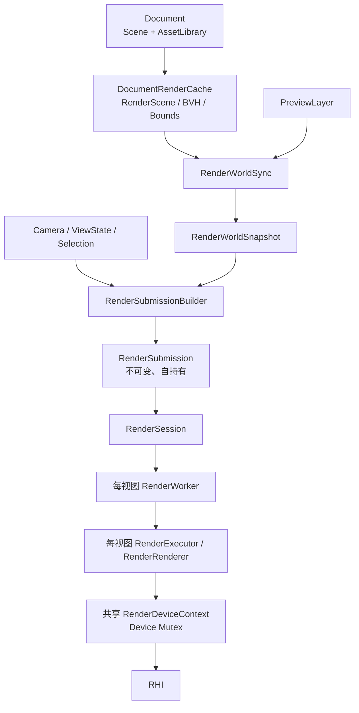
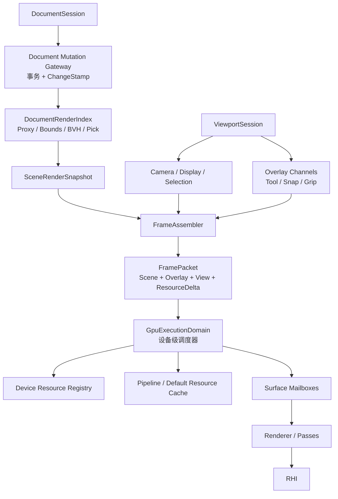
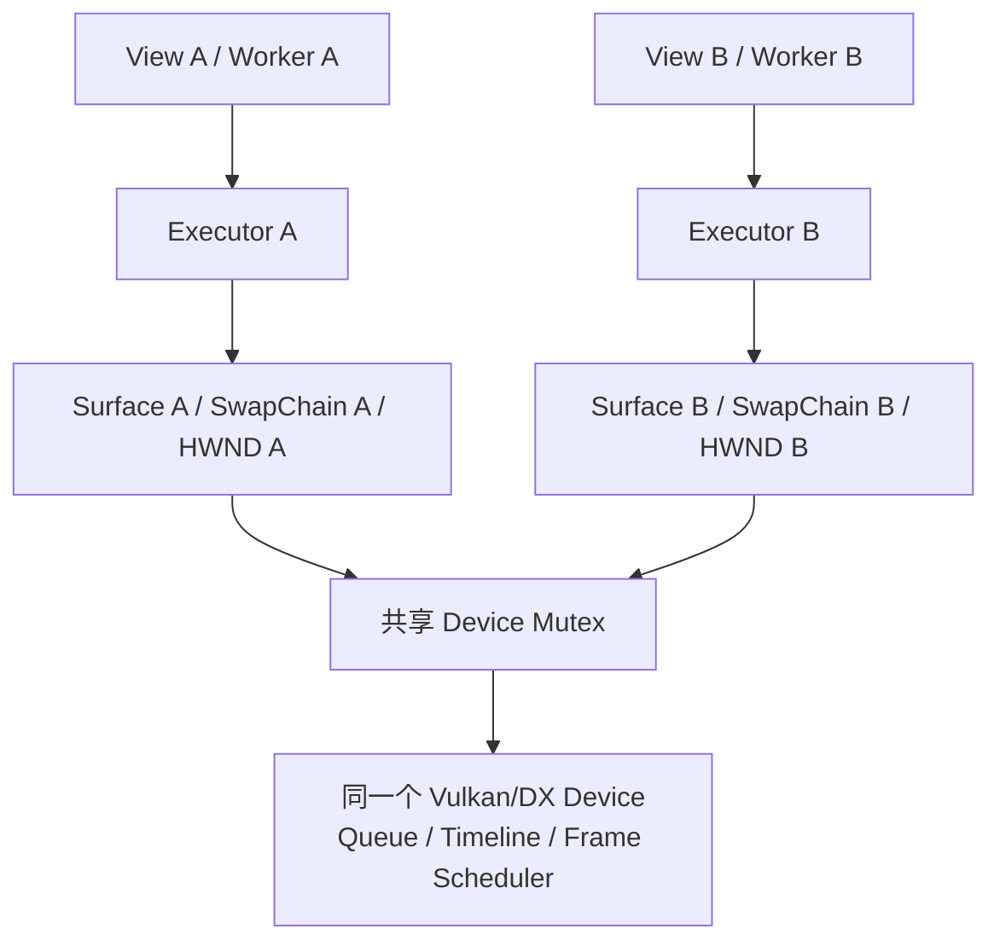
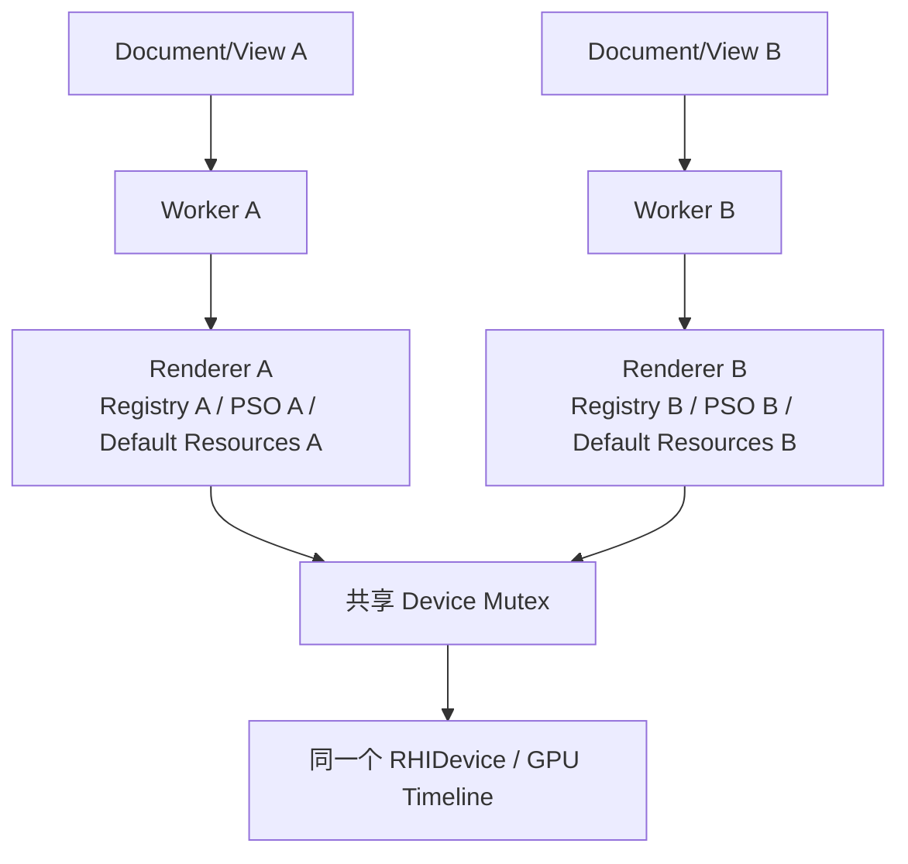
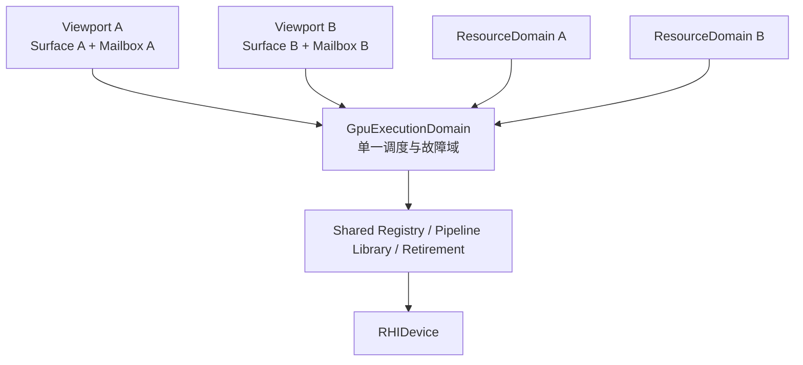

# RHI 上层架构工业化分析与演进方案

> 分析日期：2026-07-15  
> 分析范围：仅基于当前真实代码，覆盖 Document、Scene、Asset、Editor、View、Render Frontend、Render Runtime、Render Backend 到 RHI 的完整上层调用链。  
> 本文定位：架构分析与分阶段演进方案，不代表要求一次性重构，也不包含功能扩张。

## 总结

这次基于当前真实代码重新分析后，结论很明确：

- 不需要推倒重来。
- 单文档/单窗口主路径没有必须立刻停工处理的超级隐患；如果产品当前正式支持多个 Vulkan 窗口同时渲染，则呈现信号量归属需要优先闭环。
- 渲染线程、不可变提交、资源 ACK、延迟释放、Scene journal 这些底座已经比较扎实。
- 距离工业级最大的差距，已经不是“能不能正确渲染”，而是高频交互下的增量效率、状态唯一性、资源作用域和统一调度。
- 当前适合中小规模 CAD 编辑；大型场景、多文档长期运行、多视图、设备丢失恢复，还需要一轮上层架构收口。

## 当前真实架构



这里的层数本身并不过多。`RenderScene → RenderWorld → Workload → DrawCommand` 每一层都有实际语义：

- `RenderScene`：文档到渲染/拾取代理的投影。
- `RenderWorldSnapshot`：跨线程不可变输入。
- `RenderWorkload`：按显示模式过滤、分类。
- `RenderCompiler`：解析 GPU 资源和管线，生成绘制命令。
- Stage：执行固定渲染阶段。

真正的问题是这些层的更新粒度和所有权不匹配，而不是简单地“文件太多”。

## 已经做得比较好的部分

### 1. Scene journal 是正确方向

`Scene` 使用有界日志、多消费者独立 cursor、domain 防止跨 Scene 误用，并能明确要求全量恢复。这套设计可以保留。

代码位置：`src/scene/scene_change.h`。

### 2. 跨线程提交已经自持有

`RenderSubmission` 持有不可变 `RenderWorldSnapshot`、资源准备快照、视图和灯光值，不引用活的 Scene、AssetLibrary 或 PreviewLayer。这是渲染线程安全的关键基础。

代码位置：`src/view/scene_sync/render_submission.h`。

### 3. 资源与视觉帧的队列语义合理

资源批次可靠有序，普通视觉帧只保留最新一帧；帧必须等待对应资源序号完成。这个设计符合编辑器渲染需求，不应推翻。

代码位置：

- `src/view/runtime/detail/render_worker_protocol.h`
- `src/view/runtime/render_worker.cpp`

### 4. 表面和 GPU 生命周期防护较完整

resize 使用 surface generation 丢弃旧帧，GPU 资源按 submission token 延迟释放，执行失败会丢弃整个执行域并要求资源全量恢复。这些都是工业级底座。

## 核心问题

| 级别 | 问题 | 实际影响 |
|---|---|---|
| P1 | 高频预览和选择会重建整个 RenderWorld | 大模型下鼠标移动、捕捉、夹点、选择会产生明显 CPU 抖动 |
| P1 | 文档修改与渲染失效依赖手工调用 | 新增修改路径很容易忘记 refresh，出现“数据变了但画面不变” |
| P1 | 每个视图一个线程和 Renderer，但 Device 又统一加锁 | 多文档增加线程和 GPU 资源副本，却没有获得真正并行 |
| P1（多窗口 Vulkan） | Device 已允许多个 SwapChain，但呈现同步仍是 Device 全局状态 | 两个 SwapChain 使用相同图像下标时可能复用同一个二值信号量 |
| P1 | 持久资源存在两个准备入口 | 可靠资源协议不是唯一入口，职责不够封闭 |
| P2 | GPU 资源键缺少文档/资源域 | 阻碍以后将 GPU 缓存提升到设备级，并存在跨域碰撞风险 |
| P2 | 选择存在多份真相 | Scene、EditorSession、ViewState 可能失配，并制造无用场景重建 |
| P2 | 文档派生缓存属于视图 | 当前一文档一视图安全，但无法自然支持多视图共享 |
| P2 | Device 失败缺少统一恢复协调器 | 一个共享设备失败后，各文档分别发现并失败，没有统一恢复状态机 |

### 1. 高频交互仍然触发整份世界重建

`RenderSubmissionBuilder::needsRebuild()` 把 Scene generation 和 Preview generation 放在同一重建条件中。

代码位置：`src/view/scene_sync/render_submission_builder.cpp`。

一旦预览发生变化，`RenderWorldSync::rebuild()` 会：

- `world.clear()`；
- 遍历全部 SceneProxy；
- 重新解析资产和材质；
- 重新创建全部 RenderObject；
- 最后才追加少量预览对象。

代码位置：`src/view/scene_sync/render_world_sync.cpp`。

这意味着：

- 捕捉点变化；
- 夹点热状态变化；
- 绘制预览变化；
- 拖动预览变化；

都可能让整个文档渲染世界重新构造。

选择也有类似问题：Scene 中写入 `SelectionComponent` 后推进 RenderScene generation，但 Editor 渲染实际上已经使用独立的 `SelectionVisualState`。

相关代码位置：

- `src/editor/document/document_selection_bridge.cpp`
- `src/engine/render/frontend/render_workload.cpp`

这是目前最高收益的优化点。

### 2. 修改和失效没有形成闭环

`Document` 仍然公开返回可变 `Scene*` 和 `AssetLibrary*`。

代码位置：`src/io/document.h`。

正常编辑操作依靠 `DocumentOperationExecutor` 在成功后主动调用 `binding_->refresh()`。

代码位置：`src/editor/core/operation/document_operation_executor.cpp`。

因此当前规则实际上是：

> 修改 Document 后，调用者必须记得刷新 RenderBinding。

这在当前内置工具中基本成立，但不是架构不变量。以后任何代码直接修改 Scene、Asset 或构造 `DocumentEditor`，都可能忘记失效通知。

工业级做法应当是：

> 成功提交文档事务本身就发布变更；视图调度器订阅变更，而不是修改者手动调用渲染刷新。

### 3. 渲染执行域的作用域不统一

当前：

- 每个 `DocumentView` 有一个 `RenderSession`；
- 每个线程模式 Session 有一个 `RenderWorker`；
- 每个 Worker 有一个 `RenderExecutor`；
- 每个 Executor 有一个完整 `RenderRenderer`；
- 每个 Renderer 都拥有自己的管线、默认纹理、材质缓存、GPU 资产注册表；
- 但 Vulkan/DX 的 `RenderDeviceContext` 又可以共享 Device，并通过一把 mutex 串行化。

相关代码位置：

- `src/view/runtime/detail/render_session.h`
- `src/view/runtime/detail/render_executor.h`
- `src/engine/render/backend/render_renderer.h`
- `src/view/runtime/render_device_context.cpp`

所以多文档时会出现：

- N 个渲染线程；
- N 套 Renderer、PSO、默认纹理、字体和 IBL 资源；
- 最终仍通过 Device mutex 串行执行。

安全性没有问题，但扩展效率不工业化。

更合理的最终结构是：

- Vulkan/DX：一个共享 Device 对应一个渲染调度线程/执行域；
- 每个视口只是一个 Surface mailbox；
- OpenGL 因上下文亲和，可继续保持每上下文独立执行域；
- Device 级共享管线和 GPU 资源；
- Surface 级只保留交换链、尺寸和视图状态。

### 4. 持久资源准备存在双路径

现在可靠路径是：

`RenderSubmission.prepare → RenderWorker reliable queue → preparePersistentResources()`

但普通帧编译时，`prepareFrameResources()` 又会遍历材质并调用纹理 acquire。

代码位置：`src/engine/render/backend/render_renderer.cpp`。

虽然正常情况下只是命中缓存，但它仍然允许普通视觉帧创建持久纹理。这会削弱已经建立的可靠资源协议。

工业级边界应该是：

- 资源 prepare 阶段：允许创建、更新、退役持久 GPU 资源；
- frame compile 阶段：只能查询，缺失时报告合同错误，不能偷偷补建。

### 5. GPU 资源身份还不能跨文档

当前 `AssetGpuKey` 本质只是一个 `uint64_t`。场景几何键使用 AssetId 与 drawable index 异或生成，材质/贴图也主要使用原始 AssetId。

相关代码位置：

- `src/view/scene_sync/render_item_builder.cpp`
- `src/view/scene_sync/render_world_sync.cpp`

由于每个 Renderer 当前有独立 registry，所以问题暂时被隔离了。但如果以后把 registry 提升到 Device 级，不同文档的 AssetId 都从小值开始，就会直接碰撞。

在移动 GPU 缓存之前，必须先引入结构化身份：

```cpp
struct RenderResourceKey {
    ResourceDomainId domain;   // 文档/资产库/预览执行域
    AssetId asset;
    uint32_t subresource;
    ResourceKind kind;
};
```

不能先共享 registry，再补资源域。

## 建议的目标架构



关键是将三种变化彻底分开：

- 文档世界变化：更新 Scene snapshot。
- 编辑预览变化：只更新 Overlay snapshot。
- 相机、hover、显示模式变化：只更新 View snapshot。

不能再让预览或选择变化推动整份 Scene world 重建。

## 推荐里程碑

### M0：闭环 Vulkan 多 SwapChain 呈现同步（条件性）

仅当当前产品要求多个 Vulkan 窗口同时渲染时，放在其他里程碑之前完成；如果当前只承诺单窗口，则可在启用该能力前完成。

- render-finished semaphore 改为每 SwapChain、每 image 所有；
- Device FrameScheduler 不再用 Device 全局 `acquired_image_index` 映射呈现同步对象；
- 验证同 Device 双 SwapChain 交替提交、相同 image index 和独立 present queue；
- 验证 resize、窗口关闭和 DeviceLost 时各 SwapChain 同步资源的销毁顺序。

### M1：拆开 Scene 与 Overlay 热路径

最高优先级，也是收益最大的一步。

- `RenderSubmission` 分成 `sceneWorld`、`overlayWorld`、`view`。
- Scene 和 Preview 使用独立 generation、独立 snapshot。
- 预览变化只重建 OverlayWorld。
- 选择高亮只通过 ViewState 下发。
- Scene 不再因为编辑器选择而重建 RenderWorld。
- 添加诊断测试，确保 preview-only、selection-only、camera-only 都不会重建 SceneWorld。

### M2：关闭文档修改边界

- 建立唯一 `DocumentMutationGateway` 或事务入口。
- 成功事务返回统一 `DocumentChangeStamp`。
- 文档变化自动触发 RenderIndex 同步和帧失效。
- 逐步收紧公开的可变 `Scene*`、`AssetLibrary*`。
- `DocumentOperationExecutor` 不再直接知道 RenderBinding。

### M3：RenderWorld 真正增量化

- RenderWorld 保留稳定 object/material/geometry handle。
- Transform、visibility、material 修改使用 patch。
- 不再对任何 Scene generation 都执行 `world.clear()`。
- snapshot 使用版本化存储或结构共享。

### M4：资源域与设备级资源服务

- 引入 `ResourceDomainId` 和结构化 `RenderResourceKey`。
- 将 PSO、默认纹理和资产 GPU registry 提升到设备执行域。
- 每视图 Renderer 只保留表面和帧局部状态。
- 明确文档关闭、资源引用计数与延迟退役。

### M5：统一渲染调度与故障恢复

- Vulkan/DX 使用每设备一个调度线程，按 Surface 保留 latest-frame mailbox。
- Vulkan 呈现同步严格保持 Surface/SwapChain 私有，不能因设备级调度再次上移为 Device 全局图像下标状态。
- OpenGL 根据上下文能力保持隔离。
- DeviceLost 由统一运行时广播。
- 支持执行域重建、Surface 重建和资源重新准备。
- 增加多 Surface、关闭竞争、设备失败、队列压力测试。

## 暂时不应该做的事情

以下工作当前投入产出比不高：

- 不要重写 RHI。
- 不要移除 Scene journal。
- 不要把所有渲染层合并成一个 Renderer。
- 不要为了“工业级”立即引入通用 FrameGraph。
- 不要改成通用 ECS。
- 不要马上实现 Vulkan/DX12 多线程命令录制。
- 不要为了目录整齐进行大规模纯重命名。

固定的 `Workload → Compiler → Stage` 管线完全可以继续使用。当前最需要的不是更多抽象，而是把变化频率、状态所有权和资源作用域对齐。

## 专题说明：渲染执行域的作用域为什么不统一

### 什么是渲染执行域

渲染执行域不是单指“渲染线程”。它表示一组必须共同遵守以下规则的对象：

- 由谁串行调度；
- 在哪个线程或上下文访问；
- 使用哪一条 GPU 提交时间线；
- 资源上传和普通帧如何排序；
- DeviceLost 时哪些对象一起失效；
- 重建时哪些资源必须重新准备；
- 销毁时依据哪一个 submission token 延迟退役。

一个完整的执行域通常包括：

- Device、Queue 或 immediate context；
- 渲染调度器；
- Pipeline cache；
- 默认纹理、采样器和字体资源；
- GPU 资产注册表；
- 延迟销毁队列；
- 若干 Surface mailbox。

### 先澄清：当前 Device 并不是都绑定窗口

`DeviceCreateInfo` 中确实存在 `window`，但不能据此判断所有后端的 Device 都是“带窗口句柄的完整设备”。当前真实运行路径是：

- Vulkan、DX11、DX12 创建 `RHIDevice` 时传入空窗口句柄；
- 每个 `RenderSurface` 创建自己的 `SwapChain` 时，才通过 `SwapChainDesc.window` 传入对应窗口；
- OpenGL 创建 Device 时传入窗口，因为当前 `GLDevice` 同时创建并持有原生 GL Context；
- 因此 `RenderDeviceContext::canShare()` 只禁止 OpenGL，共享 Vulkan/DX 的兼容 Device。

也就是说，当前通用接口里的 `DeviceCreateInfo.window` 同时承担了 OpenGL 上下文创建参数和历史兼容参数，名字和位置容易误导；真正稳定的跨后端所有权关系应理解为：

```text
Vulkan / DX:
    Device = GPU 逻辑设备、队列、资源工厂、提交时间线
    SwapChain = 窗口、后缓冲、呈现状态

OpenGL（当前实现）:
    Device = GL Context + 资源工厂 + 提交入口
    SwapChain = 基于该 Context 的窗口呈现包装
```

代码上的直接证据是：

- `render_device_context.cpp` 仅在 OpenGL 下设置 `DeviceCreateInfo.window`；
- `render_surface.cpp` 始终在窗口 Surface 初始化时设置 `SwapChainDesc.window`；
- `swap_chain.h` 明确声明 surface 属于 SwapChain，使一个 Device 可以服务多个窗口；
- `RHIDevice::beginFrame/endFrame` 接收本帧具体使用的 SwapChain，而不是从 Device 中取得固定窗口。

DX11 的 `m_window` 和 DX12 的 `window_` 当前仍保存 `DeviceCreateInfo.window`，但创建 SwapChain 实际使用的是 `SwapChainDesc.window`。这两个字段会强化错误直觉，后续可以作为接口清理项移除或明确标注，但它们不是当前共享机制的依据。

### 当前到底如何共享

假设两个文档使用相同后端、Validation 设置和 RenderConfig：

1. View A 调用 `RenderDeviceContext::acquire()`，创建一个不绑定窗口的 Vulkan/DX Device；
2. Surface A 使用窗口 A，在该 Device 上创建 SwapChain A；
3. View B 再次 `acquire()`，从弱引用注册表取得同一个 `RenderDeviceContext`；
4. Surface B 使用窗口 B，在同一 Device 上创建 SwapChain B；
5. 两个 Executor 分别持有自己的 Surface/SwapChain，但共享 Device；
6. 每一帧把对应 SwapChain 传给同一个 Device 的 `beginFrame/endFrame`；
7. 所有资源操作、录制和提交由 `RenderDeviceContext::device_mutex_` 串行化。



共享也不是无条件的“进程全局唯一 Device”。`RenderDeviceContext::matches()` 要求 backend、validation 和完整 RenderConfig 一致；配置不一致会创建另一个 Device。注册表保存弱引用，最后一个客户端释放后，Device 会随之销毁。

### 各后端共享能力的真实结论

| 后端 | Device 与窗口关系 | 当前多 SwapChain 判断 |
|---|---|---|
| DX11 | `ID3D11Device` / immediate context 不绑定 HWND，SwapChain 绑定 HWND | 共享模型成立；必须继续串行访问 immediate context |
| DX12 | `ID3D12Device` / command queue 不绑定 HWND，SwapChain 绑定 HWND | 共享模型成立；当前 Device 全局 FrameContext 形成串行设备时间线 |
| Vulkan | `VkDevice` 不绑定窗口；每个 SwapChain 独立创建 `VkSurfaceKHR` 并选择 present queue | 对象模型成立，但当前呈现同步尚未完整做到每 SwapChain 隔离 |
| OpenGL | `GLDevice` 创建并持有窗口相关 GL Context | 当前不可共享；除非以后显式实现共享 Context/资源组 |

Vulkan 初始化代码还会为所有可用队列族请求队列，使 Device 创建后才出现的新 Surface 也能选择自己的 present queue。这进一步说明其设计目标就是一个 Device 服务多个 Surface，而不是一个窗口一个 Device。

### Vulkan 多 SwapChain 的真实同步隐患

当前 `VKFrameScheduler` 只维护一份 Device 全局状态：

```cpp
std::vector<vk::Semaphore> render_finished_semaphores_;
uint32_t acquired_image_index_ = 0;
vk::Semaphore pending_render_finished_ = nullptr;
```

创建任意 SwapChain 时，`ensureSwapchainImageSync(imageCount)` 只是把同一全局数组扩到足够长度。提交时再按当前 SwapChain 的 `acquired_image_index_` 选择信号量。

问题在于图像下标只在某一个 SwapChain 内有意义：SwapChain A 的 image 0 和 SwapChain B 的 image 0 是两个完全不同的呈现图像，却会映射到同一个 `render_finished_semaphores_[0]`。

Device mutex 只能保证 CPU 调用和图形队列提交顺序，不能证明呈现引擎已经消费完前一次二值信号量。尤其当某个 Surface 使用独立 present queue 时，A 的 present 仍可能等待该信号量，B 的提交又试图重新 signal 它。这不满足工业级多 SwapChain 对同步对象所有权的要求。

因此准确结论是：

- 单窗口 Vulkan 路径没有这个跨 SwapChain 冲突；
- 多窗口共享 Vulkan Device 的对象生命周期设计是成立的；
- 多窗口呈现同步存在条件性 P1 隐患，不能继续笼统称为“运行路径完全安全”；
- 修复目标不是改成每窗口一个 Device，而是让呈现同步真正归属于 SwapChain 或具有等价的严格所有权协议。

工业级修复可以采用以下边界：

1. 每个 Vulkan SwapChain 持有与自身 image 数量匹配的 render-finished semaphore；
2. acquire 后由当前 SwapChain 返回本图像对应的呈现完成信号量；
3. FrameScheduler 只管理设备级 FrameContext、命令缓冲和提交时间线，不再用全局图像下标推导呈现同步对象；
4. 增加同一 Device 下两个 SwapChain 交替渲染、相同 image index、独立 present queue、resize/关闭竞争测试；
5. 在修复和测试完成前，不把“多窗口 Vulkan 共享 Device”声明为完整支持能力。

这是一个边界清晰的局部修正，不需要推倒 Device/SwapChain 抽象，也不改变共享 Device 的最终方向。

### 当前代码中的三个不同作用域

当前实现同时存在三套边界：

1. **视图级执行边界**
   - 每个 `DocumentView` 创建自己的 `RenderSession`；
   - 每个线程模式 Session 创建自己的 `RenderWorker`；
   - 每个 Worker 独占一个 `RenderExecutor`；
   - 每个 Executor 独占一个 `RenderRenderer`；
   - Renderer 内部独占 GPU registry、材质缓存、管线、默认纹理、字体和 IBL。

2. **设备级提交边界**
   - Vulkan、DX11、DX12 的不同 Executor 可以共享同一个 `RenderDeviceContext`；
   - Context 内只有一份 `RHIDevice`；
   - 所有 Executor 最终通过同一把 `device_mutex_` 访问 Device。

3. **文档资产边界**
   - `AssetGpuKey` 只保证在当前文档/资产库语境内有效；
   - 文档切换时由某个视图的 Session 清空其 Renderer 内的 GPU 资产缓存；
   - 同一个文档如果以后出现多个视图，每个视图仍会各自上传一份相同资产。

也就是说：线程、Renderer 和资源缓存按视图划分，但真正的 GPU 提交和故障域却按 Device 划分；资源身份又按文档划分。这就是“作用域不统一”。

### 两个文档时的实际结构



Worker A 和 Worker B 看起来是两个独立渲染线程，但它们一旦进入真正的 RHI/GPU 操作，就必须竞争同一把 Device 锁。因此它们不能同时执行 GPU 工作，只是拥有了两个生产者线程和两套资源状态。

### 当前哪些部分仍然安全

除上述 Vulkan 多 SwapChain 呈现同步例外外，执行域的基本并发防护是成立的：

- Device mutex 串行化了共享 Device 的访问；
- 每个 Renderer 使用独立 registry，避免了不同文档原始 AssetId 的碰撞；
- 每个 Worker 内部仍然维持可靠资源队列和 latest-frame 语义；
- Session 关闭时只销毁自己拥有的 Renderer 和 Surface；共享 Device 由 `shared_ptr` 生命周期托管。

所以“每视图 Worker/Renderer、设备级锁和文档级资源身份不统一”主要是工业化扩展问题，不要求立即重写；但 Vulkan 多窗口信号量归属是独立的正确性问题，应在正式支持多窗口 Vulkan 前先闭环。

### 扩展后会出现什么代价

1. **线程数量随视图数量增长**

   打开 N 个文档会产生 N 个 Worker。它们多数时间等待，但仍增加生命周期、关闭顺序和故障处理复杂度。

2. **设备级资源重复创建**

   每个 Renderer 都可能创建一套相同 Shader、PSO、默认纹理、采样器、字体 atlas 和 IBL 结果。文档越多，重复 GPU 内存越明显。

3. **同一文档多视图无法共享 GPU 资产**

   如果以后给一个文档创建两个视口，两边会分别上传完全相同的几何和贴图。

4. **调度没有全局公平性**

   不同 Worker 只是在 mutex 上竞争。设备层不知道哪个 Surface 可见、哪个是交互中的高优先级视口，也无法按 Surface 做明确的 round-robin 或优先级调度。

5. **DeviceLost 的故障域和通知域不一致**

   Device 是共享的，一个 Executor 将 Context 标记为失败后，其他视图只能在自己的下一次执行或健康检查中分别发现失败。缺少一次设备故障对应一次全局状态转换的协调器。

6. **资源退役归属不直观**

   submission token 属于共享 Device 时间线，但资源由各 Renderer 独立持有和退役。现有实现能够保证安全，却很难形成统一的显存预算、资源统计和回收策略。

### 工业级目标不是“只有一个全局 Renderer”

正确做法是拆分共享状态与 Surface 私有状态：

**设备执行域持有：**

- Device 和统一调度线程；
- GPU 提交时间线；
- Pipeline library；
- 默认纹理、采样器、字体等设备级资源；
- 带 `ResourceDomainId` 的 GPU 资产注册表；
- 延迟退役和设备故障状态机。

**每个 Surface/Viewport 持有：**

- SwapChain 或 RenderTarget；
- width、height、surface generation；
- latest-frame mailbox；
- ViewState；
- 依赖目标格式和 MSAA 的少量 Surface pipeline state；
- 截图和 resize 控制状态。



### 不同后端的策略

- **DX11**：immediate context 天然适合一个设备级串行执行线程。
- **Vulkan / DX12**：当前 RHI 使用串行执行路径时也可以先采用一个设备级调度器；将来若需要并行命令录制，再在执行域内部扩展，不向 View 暴露多个 Worker。
- **OpenGL**：原生上下文具有线程亲和性。在没有共享上下文资源服务前，应继续保持每上下文独立执行域，不能为了形式统一强行合并。

### 这项调整的前置条件

不能现在直接把 `AssetGpuRegistry` 移到 `RenderDeviceContext`，否则不同文档从相同 AssetId 开始分配时会发生资源键碰撞。

正确顺序是：

1. 先建立 `ResourceDomainId + RenderResourceKey`；
2. 再区分设备共享资源和 Surface 私有资源；
3. 然后把共享 registry、pipeline 和默认资源提升到设备执行域；
4. 最后将每视图 Worker 收敛为每设备调度器和每 Surface mailbox。

因此它属于 M4、M5，而不是当前第一步。当前应先完成 Scene/Overlay 热路径分离和文档变更闭环。

## 最终判断

当前架构已经越过了“需要推倒重来”的阶段。

如果要正式承诺多窗口 Vulkan，先完成条件性 M0；再完成 M1、M2，架构清晰度和大模型交互稳定性会提升一个明显等级；M3、M4、M5 则决定它能否真正达到多文档、大场景、长期运行的工业级渲染运行时。
